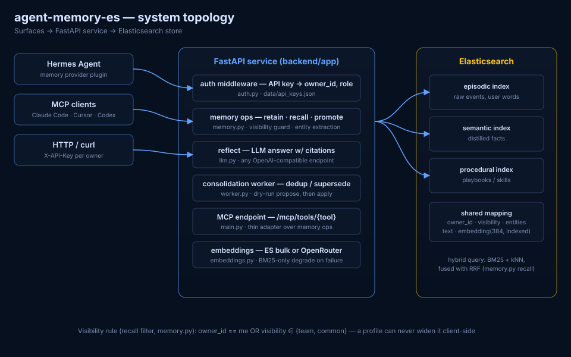
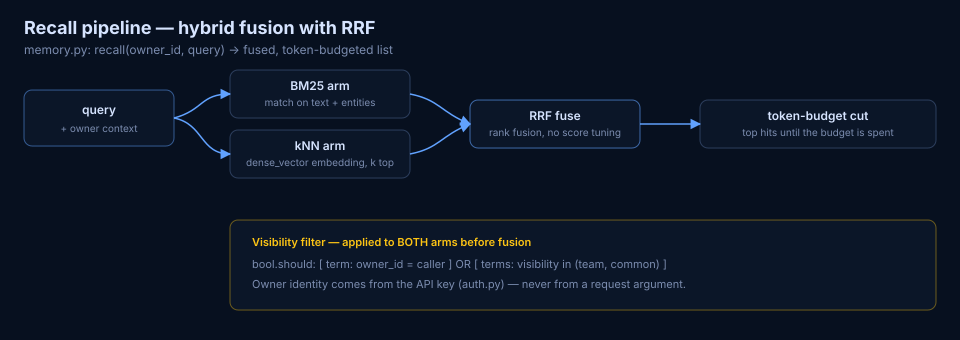

# Architecture — agent-memory-es

> Grounded in `backend/app/*.py` as of this commit; every claim names its source file. Diagrams: [topology](diagrams/architecture.svg) · [recall pipeline](diagrams/recall-pipeline.svg). Interactive walkthrough: [explainer](explainer.html).

## System topology

Three planes:

| Plane | Component | Source |
|---|---|---|
| **Surfaces** | Hermes memory-provider plugin, MCP endpoint, plain HTTP | `backend/hermes_plugin/agent_memory_es`, `main.py:87` |
| **Service** | FastAPI app: auth, memory ops, reflect, consolidation worker | `backend/app/main.py` |
| **Store** | Elasticsearch, three indices (episodic / semantic / procedural) | `store.py` (`KINDS`, `MAPPINGS`, `ensure_indices`) |

## Memory model

Every document carries the same envelope (`store.py` MAPPINGS):

- `kind` ∈ `episodic` (raw events — the user's words, never the assistant's), `semantic` (distilled facts), `procedural` (playbooks/skills)
- `owner_id` — bound to the API key that wrote it
- `visibility` ∈ `private` / `team` / `common`
- `text`, `entities` (keyword-extracted, `memory.py:extract_entities`), `embedding` (384-dim dense_vector, indexed), `occurred_at`, `active`

## API surface (`main.py`)

| Route | Purpose |
|---|---|
| `POST /memory/retain` | store a memory (kind + visibility) |
| `POST /memory/recall` | hybrid search, visibility-filtered |
| `POST /memory/promote` | private → team/common, guarded |
| `POST /memory/consolidate` | dedup/supersede pass |
| `POST /memory/reflect` | LLM answer over recalled evidence, with citations (`llm.py`) |
| `POST /mcp/tools/{tool}` | thin MCP adapter over the same ops |
| `POST /admin/keys` | mint API key (X-Admin-Token) |
| `GET /health` | liveness |

## Tenancy & isolation

- **Identity**: API key → `owner_id` + role (`auth.py`, keyfile `data/api_keys.json`). The owner is *never* a request argument.
- **Read filter** (`memory.py:_visibility_filter`): `owner_id == caller OR visibility ∈ {team, common}` — applied to both retrieval arms, so a client cannot widen visibility.
- **Write guard** (`memory.py:guard_promotion`): deterministic marker regex blocks promoting a private memory that contains sensitive markers (api key, token, secret, …) to team/common. Same text, same decision — no classifier involved.
- **Rejection tombstones** (`tombstone.py`): the user's "forget this / that's wrong" verdicts block re-learning the same value at retain time.

## Recall pipeline

1. **BM25 arm** — match over `text` + `entities`
2. **kNN arm** — dense_vector top-k (embeddings via ES `_bulk` inference or any OpenAI-compatible endpoint, `embeddings.py`; on embedding failure the system degrades to BM25-only — `memory.py:retain` swallows the embed error)
3. **RRF fusion** — rank-based, no score tuning across arms
4. **Token-budget cut** — top fused hits until the budget is spent

## Consolidation worker (`worker.py`)

Background loop (default every 600 s, `AMES_CONSOLIDATE_INTERVAL`): for every known owner, a **dry-run pass** proposes duplicates/supersessions (visibility only), then an **apply pass** supersedes old semantic facts; `keep_both` cases are surfaced, never auto-merged. Superseded docs are flagged inactive — audit history preserved.

## Deployment (`backend/docker-compose.yml`)

`ames-backend` (uvicorn :8123) + `ames-worker` + a Elasticsearch instance; `AMES_ADMIN_TOKEN` required. Env knobs: `AMES_ES_URL`, `AMES_EMBED_BACKEND`, `AMES_LLM_BASE` (OpenAI-compatible endpoint for reflect).

## Hermes integration

The standalone plugin ([hermes-plugin-agent-memory-es](https://github.com/patrykkopycinski/hermes-plugin-agent-memory-es)) registers three agent tools — `agent_memory_recall`, `agent_memory_retain`, `agent_memory_reflect` — maps Hermes turn sync to the episodic tier, and mirrors built-in memory writes into the semantic tier. A copy ships in `backend/hermes_plugin/agent_memory_es` for reference.

## Testing

`backend/tests/` — API behavior, auth migration, promotion guard, tombstones, consolidation, worker, reflect, plus a recall eval harness (`eval_recall.py`).
